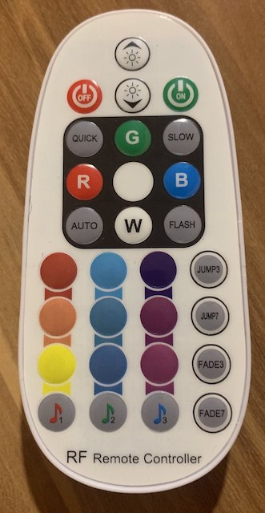
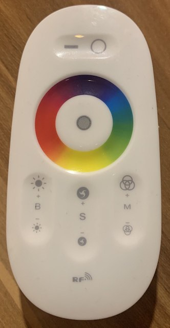

# 433 MHz LED controller protocol

I recently acquired some generic Chinese RF remote controllers for LED strips that use the popular 433 MHz ISM frequency band.
I had hoped that [pilight](https://www.pilight.org/) would already include a protocol decoder/encoder for them but it currently
doesn't; however, after a few hours of tinkering I was able to decode and replicate the RF commands using pilight's raw protocol.

I'm sharing what I've found here in case it will be helpful to others, or maybe someone who is better at C++ than I am will even
use it to write a pilight protocol module.

I have also included some quick&dirty utility scripts that should help you decode the protocol of similar LED controllers.

# The controllers in question

I looked at two types of controllers: One of them is a simple 24V RGB PWM controller for 5050 type LEDs or similar.
The remote looks like this:

The other one controls individually adressable TM1809 LED strips and was found in a "minimal lamp" that's currently being sold
all over the internet. The remote looks like this:

# Protocol

Both controllers use three-byte payloads and the exact same encoding. The only difference between the two controllers are the commands
themselves. The receivers also seem to be _very_ tolerant in their signal decoding, as button presses from one remote will occasionally
trigger the other receiver even though the payloads aren't all that similar.

## Encoding

The three byte payload is first converted into binary, e.g.:

`0x99 0x38 0x01` => `100110010011100000000001`

Then a simple Manchester encoding is applied where a binary 0 equals a short (~400 µs) pulse follow by a long (~1200 ~µs) pulse,
and a binary 1 has them reversed:

`100110010011100000000001` => `1200 400 400 1200 400 1200 1200 400 1200 400 400 1200 400 1200` etc.

Finally, the transmission ends with a short pulse and a ~12 ms footer (`400 12000`). As such, every transmission consists of exactly
50 pulses.

## Commands

The commands for the simple RGB controller are:

| Command        | Remote button   |
|----------------|-----------------|
| 0x55 0x13 0x02 | Power off       |
| 0x55 0x13 0x04 | Power on        |
| 0x55 0x13 0x03 | Brightness down |
| 0x55 0x13 0x01 | Brightness up   |
| 0x55 0x13 0x06 | Auto            |
| 0x55 0x13 0x08 | Flash           |
| 0x55 0x13 0x09 | Speed up        |
| 0x55 0x13 0x0c | Speed down      |
| 0x55 0x13 0x15 | Music 1         |
| 0x55 0x13 0x16 | Music 2         |
| 0x55 0x13 0x17 | Music 3         |
| 0x55 0x13 0x10 | Jump 3          |
| 0x55 0x13 0x14 | Jump 7          |
| 0x55 0x13 0x1c | Fade 3          |
| 0x55 0x13 0x18 | Fade 7          |
| 0x55 0x13 0x05 | Red             |
| 0x55 0x13 0x0a | Green           |
| 0x55 0x13 0x0b | Blue            |
| 0x55 0x13 0x07 | White           |
| 0x55 0x13 0x0d | Bright red      |
| 0x55 0x13 0x11 | Orange          |
| 0x55 0x13 0x19 | Yellow          |
| 0x55 0x13 0x0e | Light blue      |
| 0x55 0x13 0x12 | Turquoise       |
| 0x55 0x13 0x1a | Dark turquoise  |
| 0x55 0x13 0x0f | Dark blue       |
| 0x55 0x13 0x13 | Purple          |
| 0x55 0x13 0x1b | Magenta         |

The commands for the "minimal lamp" TM1809 controller are:

| Command        | Remote button      |
|----------------|--------------------|
| 0x99 0x38 0x01 | Toggle on/off      |
| 0x99 0x38 0x03 | Toggle mode        |
| 0x99 0x38 0x0a | Brightness down    |
| 0x99 0x38 0x0c | Brightness up      |
| 0x99 0x38 0x0b | Effect speed down  |
| 0x99 0x38 0x05 | Effect speed up    |
| 0x99 0x38 0x09 | Effect preset down |
| 0x99 0x38 0x07 | Effect preset up   |
| 0x99 0x38 0xc0 .. 0x99 0x38 0xd8 | Static color (blue..cyan..green..yellow..orange..red) |

# Scripts

## parse.pl

This script parses the output from `pilight-raw`, looks for valid three-byte transmissions and prints them out in hex.
Usage: `pilight-raw -L | perl parse.pl`

## send.pl

Can be used to manually send commands. Run `perl send.pl`, type in three-byte hex codes (such as `99380a`) and it will encode
them and call `pilight-send` to transmit them.
